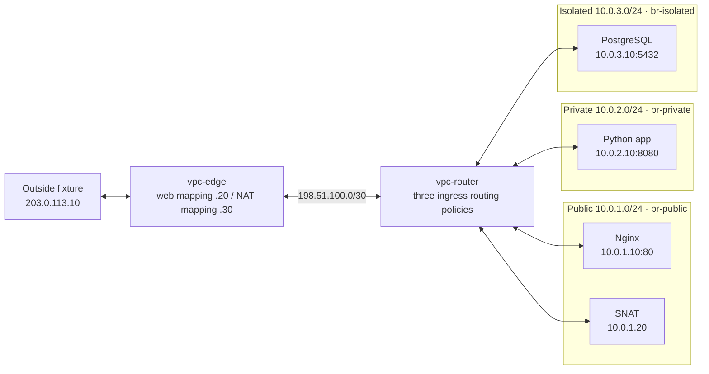
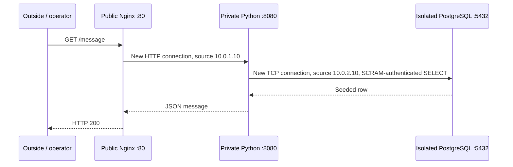
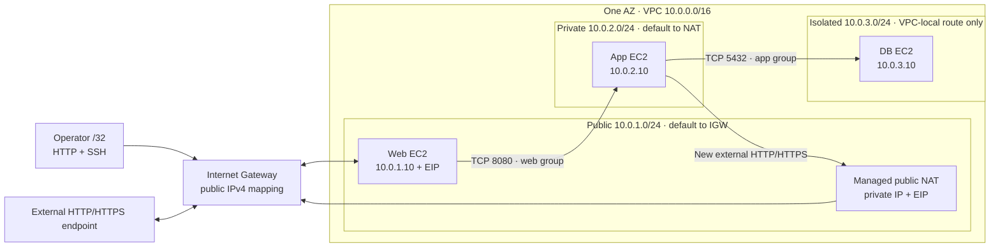

# One request, three subnets

The lab puts a public Nginx proxy, private Python app, and isolated PostgreSQL
database in separate `/24` subnets. The [Linux version](local-lab.md) runs in
eight network namespaces; the [AWS version](aws.md) uses three EC2 instances
in one Availability Zone. Both exercise the same service path and private
outbound access. This is a disposable IPv4 demonstration with no availability
or production-security claim.

## Linux topology

The three bridges live in `vpc-switch`, which has no IPv4 address. Every
workload's off-subnet next hop is its subnet's `.1` router interface. No link
is attached to a host interface. `203.0.113.0/24` and `198.51.100.0/30` are
documentation ranges used only inside the sealed lab.

Router ingress selects table `101` for public, `102` for private, or `103`
for isolated. Each contains the three internal subnet routes. External
defaults are edge, NAT, and `unreachable`, respectively. A terminal
`unreachable` matters in Linux: a missing route could otherwise fall through
to the router's `main` table. The [recorded demo](demo.md) includes actual
route/rule dumps and captures; [lab.sh](../lab.sh) creates this fixed topology.

## Follow a database-backed request

1. The local client connects to `203.0.113.20:80`. Edge DNAT changes the
   destination to `10.0.1.10:80`; the source remains the outside fixture.
   The router's return path and edge connection tracking reverse that mapping.
2. Nginx opens a separate connection from `10.0.1.10:<client port>` to
   `10.0.2.10:8080`. Web resolves its gateway's MAC with ARP; table `101`
   selects the private interface. The app sees web's private IP as its peer.
3. The app opens `10.0.2.10:<client port> -> 10.0.3.10:5432`. Table `102`
   uses its direct isolated-subnet route. The real PostgreSQL query uses TCP,
   so a shared Unix socket cannot bypass the network.
4. The database replies to the app's client port through table `103`'s
   private-subnet route. Stateful workload filters permit replies even though
   the database cannot initiate general TCP egress. The response travels back
   through the two separate HTTP connections.

`/health` checks the app without querying PostgreSQL. If a fresh database
connection is blocked, `/health` still returns 200 and `/message` returns
503. This distinguishes a database-path failure from a dead app. Internal
routes, firewall permission, and a listening service are separate requirements.

## Follow private egress

The app sends a fresh connection to `203.0.113.10:8080` through its gateway.
Table `102` sends it to NAT on the public segment. NAT forwards back out its
same interface, changes the source to `10.0.1.20`, and sends it to the router.
It now arrives on `public`, so table `101` selects edge. Edge changes that
source to `203.0.113.30`. The fixture reports the translated peer.

| Capture point | Source | Destination |
| --- | --- | --- |
| App outgoing SYN | `10.0.2.10:<client port>` | `203.0.113.10:8080` |
| NAT outgoing SYN | `10.0.1.20:<translated port>` | `203.0.113.10:8080` |
| Edge outgoing SYN | `203.0.113.30:<translated port>` | `203.0.113.10:8080` |
| App incoming SYN-ACK | `203.0.113.10:8080` | `10.0.2.10:<client port>` |

The [traffic check](../tests/traffic.py) captures these four points on one
fresh connection and checks both namespaces' conntrack original/reply tuples.
Replies reverse both translations. Source-port preservation is not assumed.
Removing the private default breaks external access while the direct database
route still works; repairing it restores a new external connection.

## AWS counterpart and evidence

Each subnet has its own associated AWS route table and the VPC-local route.
The DB briefly uses NAT to install packages, then its bootstrap default and
HTTP/HTTPS egress rules are removed. Web/app are allowed selected outbound
HTTP/HTTPS; only web has a public instance mapping. Operator HTTP and SSH are
limited to the supplied `/32`. SSH to private hosts uses web as a jump host;
it does not allow web's service to query PostgreSQL.

Security-group references express web-to-app and app-to-DB permission.
[Security groups](https://docs.aws.amazon.com/vpc/latest/userguide/vpc-security-groups.html)
track established connections; [network ACLs](https://docs.aws.amazon.com/vpc/latest/userguide/vpc-network-acls.html)
require explicit return permissions. The ordinary deployment uses the default
permissive NACL. The fault runner temporarily associates a custom DB NACL,
removes its app reply rule, proves the failure, and restores the original.

The [October 4 reproduction](../evidence/aws-reproduction-2026-10-04.md) records
real service queries, NAT-EIP source checks, denied traffic with healthy
controls, and per-resource teardown. The [October 5 exercises](../evidence/aws-faults-2026-10-05.md)
record two complete runs of three AWS faults and repairs. Their matched
app/DB SYN and SYN-ACK headers support the controlled return-rule diagnosis.
AWS's managed router, IGW, and NAT internals have no guest capture point here.

| First-release scope | Verified mechanism |
| --- | --- |
| Linux faults | Forwarding, private default, SNAT, DB ingress, stateless reply ports |
| AWS faults | Private default, DB security-group port, DB NACL reply ports |
| Linux isolation | No external DB route; selected TCP host rules; ICMP retained for diagnostics |
| AWS isolation | No general DB internet route after bootstrap; selected group permissions |

These are distinct coverage sets. AWS-managed forwarding and SNAT are not
faulted directly. Neither environment makes the DB an air gap: VPC-local
services remain reachable under their access policy, and AWS-provided DNS is
separate from general internet access. The release is single-AZ and IPv4.
Further AWS cases, multiple AZs, IPv6, and an EC2 NAT comparison are follow-up
work. The recorded AWS estimate is about $0.089/hour plus data, transfer, tax,
and billing rounding; the final bill was not observed. Both recorded cloud
deployments were destroyed and independently checked.
